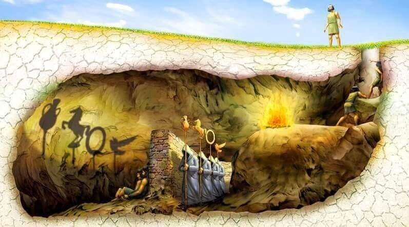

<div align="center">

# Between the Fire and the Sun

*A study of the representational alignment between diffusion models and Macaque cross timesteps and ROIs*



</div>

## About the Project

The goal of this project is to study the representational alignment between diffusion models and macaque neural activity across different timesteps and regions of interest (ROIs). Previous work showed that there is a correlation between the representations of discriminative deep neural networks and neural activity in biological brains. Others showed that diffusion models can produce representations that perform similarly to discriminative models in downstream tasks. However, the representational alignment between diffusion models and biological brains has not been studied yet.

This project aims to fill this gap by first determining if there is any representational alignment between diffusion models and macaque neural activity, and then studying how this alignment varies across the diffusion timesteps and ventral visual stream regions.

This project was developed during the NeuroAI course of the [Neuromatch Academy](https://neuromatch.io/academy/) 2026.

You can find more about the project and the results in our [project presentation](https://github.com/ibrahimhabibeg/diffusion-brain-alignment/blob/main/slides/NMA_NeuroAI_2026_Platonics.pdf) and [project page](https://ibrahimhabibeg.github.io/diffusion-brain-alignment-blog/) (coming soon).

## Quickstart

This project uses [`uv`](https://github.com/astral-sh/uv) for Python environment management and `Snakemake` for pipeline orchestration.

**1. Clone and sync the repository**

```bash
git clone https://github.com/ibrahimhabibeg/diffusion-brain-alignment.git
cd diffusion-brain-alignment
uv sync
```

**2. Run the pipeline**
The pipeline is fully automated and will handle data downloading, processing, statistics, and plotting.

```bash
uv run snakemake -c1 --configfile config.yaml
```

## Configuration

Global experimental parameters are managed via the `config.yaml` file. Key parameters include:

- **DATA_DIR**: The base directory for storing raw and processed data.
- **MONKEYS** & **ROIS**: Subjects (e.g., monkeyF, monkeyN) and brain regions (e.g., V1, V4, IT) to analyze.
- **NOISE_LEVELS**: The specific Stable Diffusion noise timesteps to extract.
- **SUBSET**: A boolean flag to run a rapid test of the pipeline using a single image per category.

You can change the config file to change the parameters of the experiment. If you want to run the pipeline quickly, you should decrease the number of noise levels in the pipeline.

## Pipeline Architecture

The workflow is broken down into four sequential stages, orchestrated by the `Snakefile`:

- **0.x Data Acquisition**: Downloads the THINGS image database and macaque neural recordings.
- **1.x Data Processing**: Extracts Stable Diffusion UNet mid-block activations, prepares the neural data, and orders image categories.
- **2.x Statistical Alignment**: Computes Representational Dissimilarity Matrices (RDMs) and performs Representational Similarity Analysis (RSA) to quantify the alignment between diffusion model representations and macaque neural activity.
- **3.x Visualization**: Consumes the statistical results to generate Matplotlib figures (RSA curves, heatmaps, null distributions, and RDM matrices).

## Authors

- Ibrahim Habib
- Alina Rojas
- Tomasz Kuliński
- Rongxuan Tian
- Siping Chen
- Alina Garcia
- Beste Tasci
- Justin Yuen
- Beatriz Aleixo
- Benet Manzanares Salor
- Hana Manzanares Salor

## Acknowledgements

We thank our project TA, Reza Rajabli, for his guidance and support throughout the project. We also thank our pod TA, Tshiangomba Kasonsa, for his help throughout the academy. We are grateful to the Neuromatch Academy for providing this opportunity to learn and collaborate on this project.
